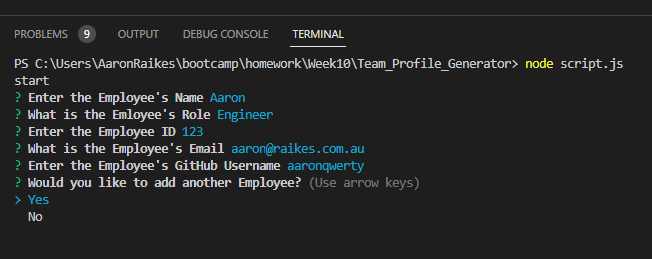
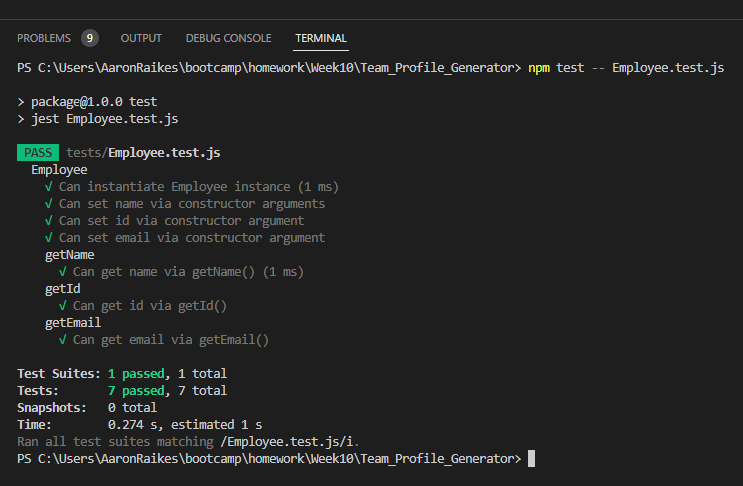
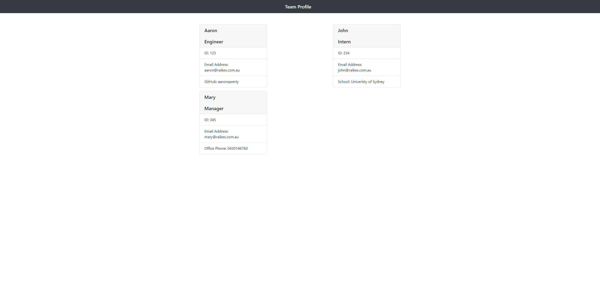

# Team_Profile_Generator

 
     
## Description
This app guides a user through the process of employee listing and generating it as a HTML for them. 
The user simply follows the instructions using the JSON inquirer package. 
The code also includes a Jest Test file which can be operated via terminal. 
 
## Table of Contents
* [Installation](#installation)
* [Usage](#usage)
* [License](#license)
* [Screenshots](#Screenshots)
* [Demonstration](#Demonstration)
* [Tests](#tests)
* [Questions](#questions)
 
## Installation
Prior to using the app, a user will be required to install the JSON packages included in the application. 
 
## Usage
The user should open the script.js file in Integrated Terminal, then type 'node script.js', this will start the app. 
The user should then follow the instructions, and in a few simple steps they will have a teams.html file located in the output folder. 
 
## Licence    
 
Name: MIT 
Further information about this licence can be found here; https://opensource.org/licenses/MIT 
 
## Screenshots
 
 
 
 

## Demonstration
[Video Demonstration](https://drive.google.com/file/d/1yI0Q1PFTLUHZtU929AJuJ2n9yveXgYNR/view?usp=share_link) 
 
## Questions
If you have any questions or comments about this README, please contact me via email; [aaron.raikes@gmail.com](mailto:aaron.raikes@gmail.com) 
You can also see my other GitHub projects here; [https://github.com/aaronqwerty](https://github.com/aaronqwerty) 